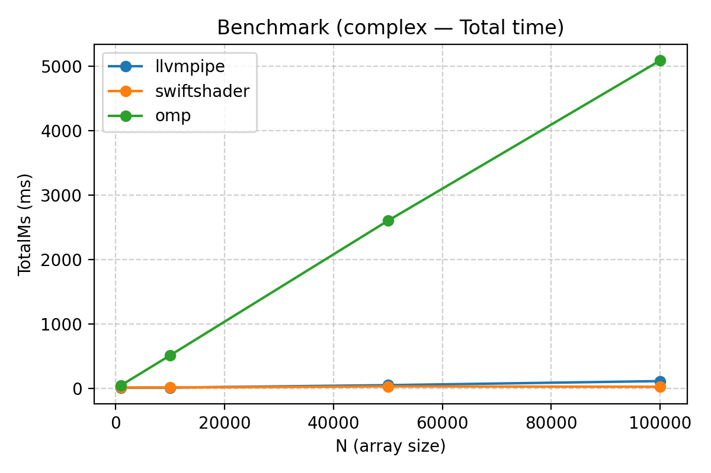
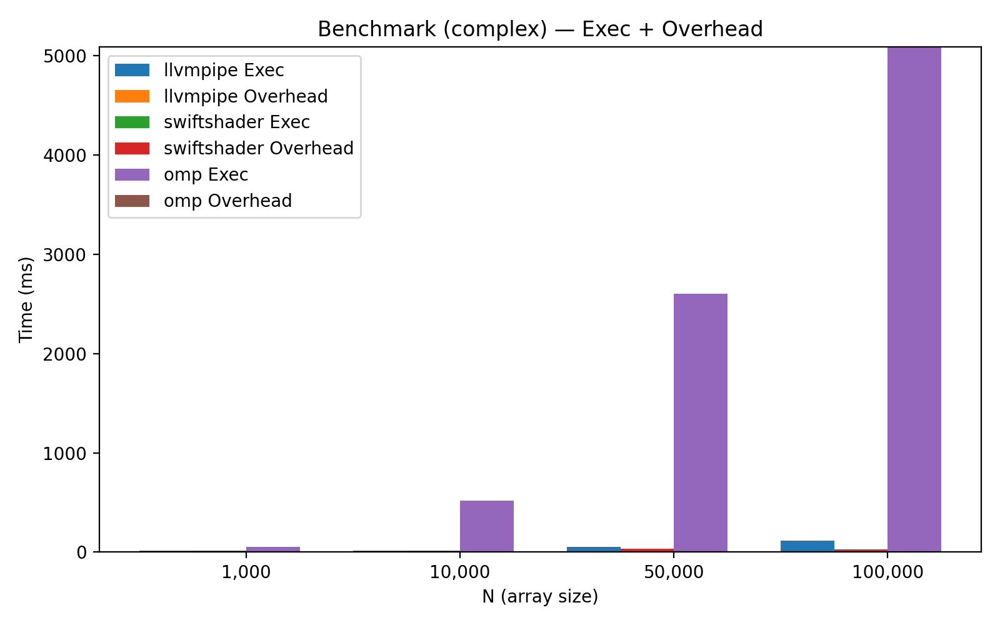
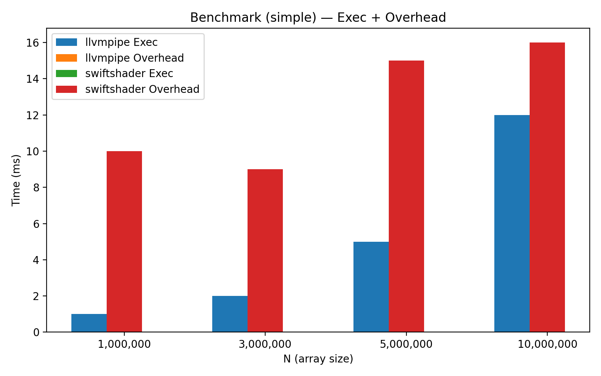
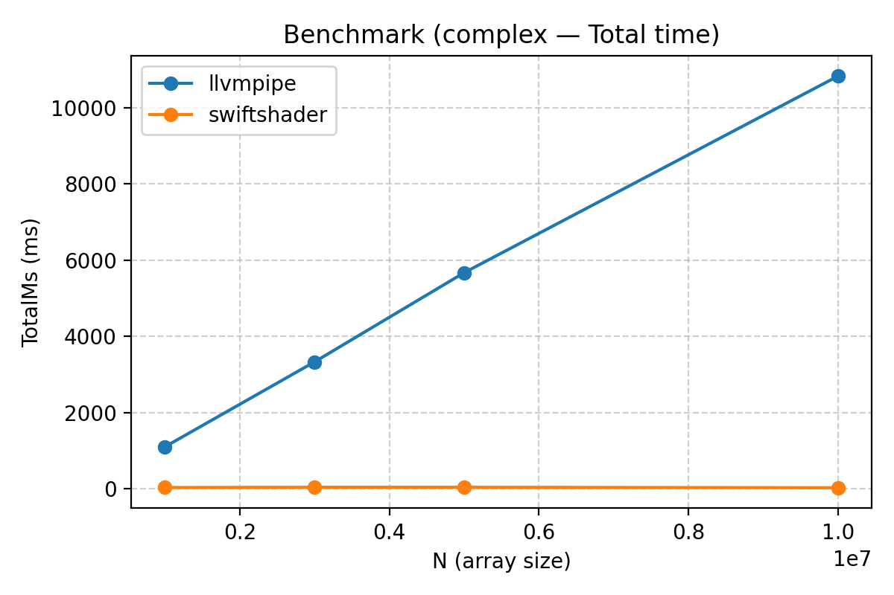

# Benchmarking Parallel Processing Approaches on CPUs

This repository benchmarks different approaches to parallel processing on CPUs and examines their trade-offs.

## Motivation

There are many ways to exploit CPU parallelism. Traditional CPU-native frameworks (e.g. **OpenMP**) are very effective for structured CPU workloads like numerical loops or dense linear algebra.  

In this project, however, the focus is different: we only experiment with **GPU-style kernels** (the kind of code you would normally run on a GPU). Since WebGPU can fall back to CPU execution through software rasterizers such as **LLVMpipe** (Mesa) or **SwiftShader** (Google), we can directly compare these GPU-fallback paths against a CPU-native baseline (OpenMP).

The goal is not only to measure raw performance but also to understand the trade-offs:
- How do GPU-style runtimes (WebGPU + SwiftShader/LLVMpipe) behave when emulated on CPUs?
- How do they compare to a CPU-native framework (OpenMP) when forced to run GPU-like code?
- What are the overheads and benefits of using a GPU-first programming model on a CPU?

## Experiments

- Benchmarks run **two shader types**:
  - `simple`: element-wise multiply `A[i] * B[i]`
  - `complex`: multiply followed by heavy math loops and forced branching  
- Each run reports:
  - **Execution time** (GPU dispatch or loop execution)
  - **Overhead time** (setup, submission, synchronization)
  - **Total time** (execution + overhead)

Results are aggregated into CSVs and plotted in `results/` folder.

## Preliminary Results

### Small-scale (OMP + LLVMpipe + SwiftShader)

- **OMP struggles badly** on GPU-style kernels, even at relatively small input sizes (≥50k).  
- However, **OMP overhead is essentially zero**, unlike the GPU backends which pay dispatch/sync costs.

**Complex shader — total runtime (OMP clearly underperforms):**  
!

**Complex shader — execution vs. overhead breakdown (OMP shows no overhead):**  


### Large-scale (LLVMpipe + SwiftShader only)

- **LLVMpipe has minimal overhead**, but execution time grows significantly with input size.  
- **SwiftShader dominates on complex kernels** — overhead remains, but execution cost is trivial, so total time is far lower than LLVMpipe.

**Simple shader — stacked breakdown (LLVMpipe's execution dominates, overhead negligible):**  



**Complex shader — total runtime (SwiftShader crushes LLVMpipe):**  



## Key Takeaways

- **OMP**  
  - Performs very poorly on GPU-style kernels, even at small sizes .
  - Its only advantage is **zero overhead**, since it runs directly without dispatch/sync layers.  

- **LLVMpipe (Mesa)**  
  - Scales execution time with input size.  
  - **Overhead is minimal** and essentially negligible compared to execution.  
  - Stronger on simple kernels, but quickly outpaced on complex ones.  

- **SwiftShader (Google)**  
  - Imposes more overhead, but **executes complex GPU-style kernels far faster than LLVMpipe**.  
  - As a result, overhead becomes trivial when compared to its gains on heavy compute workloads.  
 
## Additional Find
While **SwiftShader** is expectedly dominant here, it does have a major downside. Workgroup size is capped at 256 on CPU, limiting its scaling behavior significantly. LLVMpipe, on the other hand, scales with the device the same way typical GPU drivers would allow. This downside can be seen within the source code from the SwiftShader codebase:
```
{ 256, 256, 64 },                            // maxComputeWorkGroupSize[3]
```
This makes it so that very large inputs cannot be run with a SwiftShader backend even if the device can support a larger workgroup. This could not be displayed in the graphs but is an important finding.